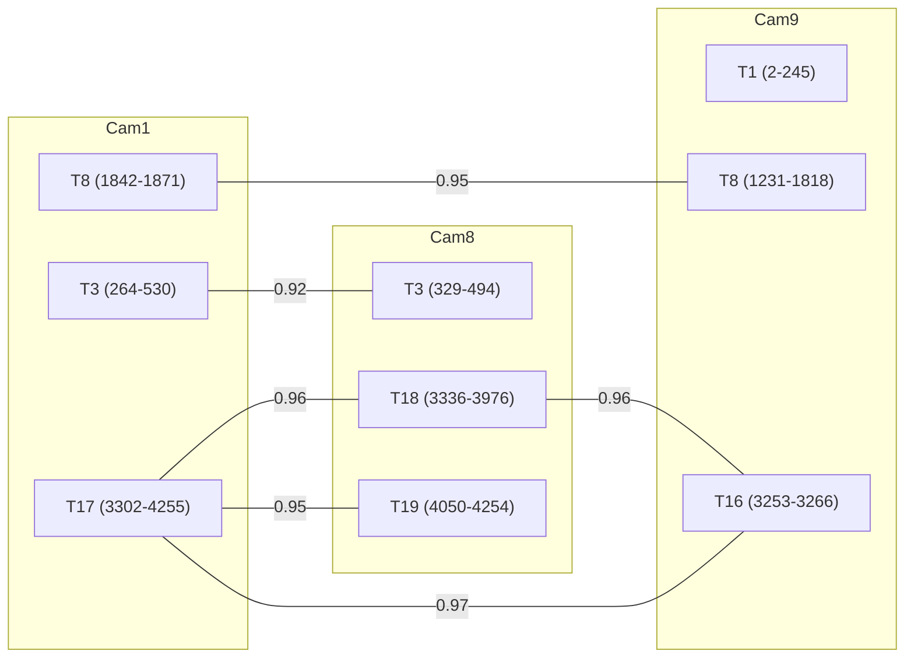

# Interactive Cross-Camera Matching via Graph Clustering

## Problem

Given N single-camera tracklets across K cameras, determine which tracklets correspond to the same person. This is a **correlation clustering** problem where:
- **Nodes** = tracklets (camera × continuous detection segment)
- **Edges** = pairwise ReID cosine similarity (precomputed once)
- **Annotations** = human labels: same-person (positive edge) or different-person (negative edge)

The goal is to **minimize the number of human annotations** needed to fully resolve all identities.

## Graph structure



Each edge has a fixed precomputed similarity score. The annotator's job is to label edges as ✓ (same) or ✗ (different) until all connected components are resolved.

## Constraint propagation

Each annotation triggers constraint propagation:

### On ✓ (A = B confirmed)

1. **Merge clusters**: A and B become one identity group
2. **Temporal exclusion**: any tracklet overlapping in time on the same camera as any member of the group **cannot** be the same person → mark those edges as ✗ automatically
3. **Transitivity**: if A=B and B=C already confirmed, then A=C is implied → no need to ask
4. **Collapse proposals**: if both (C, A) and (C, B) are pending, keep only the higher-scored one

### On ✗ (A ≠ B confirmed)

1. **Anti-edge propagation**: if A=C is later confirmed, then C≠B is implied
2. **Separate clusters**: A and B are blocked from merging, even transitively

## Optimal annotation ordering (active learning)

**Don't label highest-score-first.** Instead, pick the annotation that maximally reduces the remaining uncertainty.

### Scoring function for next annotation

For each candidate pair (A, B) to annotate next:

```
value(A, B) = uncertainty(A, B) × impact(A, B)
```

Where:

- **uncertainty(A, B)** = `1 - |2 × P(same) - 1|`
  - Highest at P = 0.5 (the decision boundary), zero when P → 0 or P → 1
  - P(same) can be estimated from the cosine similarity score (calibrated via logistic regression on a few seed annotations, or just using the raw score)

- **impact(A, B)** = average number of proposals eliminated across both outcomes:
  - Simulate "yes" → count proposals eliminated by temporal exclusion + transitivity
  - Simulate "no" → count proposals eliminated by anti-edge propagation
  - Average the two

### Intuition

| Strategy | What it labels next | Problem |
|----------|-------------------|---------|
| Highest score first | 0.97 pair (almost certainly ✓) | Low information gain — you already know the answer |
| Lowest score first | 0.80 pair (almost certainly ✗) | Also low information gain |
| **Active learning** | ~0.92 bridge pair between two large clusters | **Maximum information gain** — either outcome eliminates many proposals |

### Bridge pairs are most valuable

A "bridge pair" connects two otherwise disconnected clusters. Labeling it either:
- **Merges two clusters** → eliminates all inter-cluster proposals + temporal conflicts
- **Separates two clusters** → confirms they are distinct identities, prevents future transitivity

In the current data with 29 tracklets and 353 cross-camera pairs, labeling ~10-15 well-chosen bridge pairs should resolve all identities, vs ~25-30 if labeling top-down.

## Implementation sketch

```
State:
  clusters: UnionFind over tracklets
  anti_edges: set of (cluster_i, cluster_j) pairs confirmed as different
  pending: list of (score, tracklet_a, tracklet_b) proposals
  temporal_map: {(camera, frame_range)} per cluster for exclusion checks

Loop:
  1. Pick pair (A, B) with highest value(A, B) from pending
  2. Show annotator side-by-side crops of A and B
  3. Annotator labels ✓ or ✗
  4. Propagate constraints:
     - If ✓: merge(A, B), add temporal exclusions, remove transitively resolved pairs
     - If ✗: add anti-edge(cluster(A), cluster(B)), propagate
  5. Remove resolved/impossible pairs from pending
  6. Repeat until pending is empty or all tracklets assigned

Output:
  Final cluster assignments → merged track.txt with global person IDs
```

## Stopping criterion

The annotator can stop at any time. Remaining unlabeled pairs are resolved by the system:
- Pairs above a confidence threshold (e.g., 0.95) → auto-accept
- Pairs below a rejection threshold (e.g., 0.85) → auto-reject
- Remaining pairs → leave as separate identities (conservative)

The thresholds can be tuned based on the annotations already provided (the labeled pairs serve as calibration data for the ReID score).
